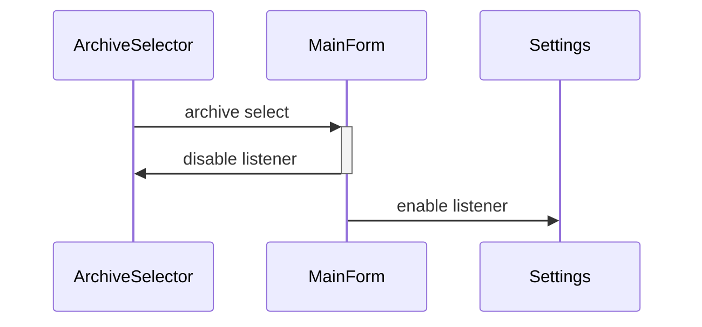
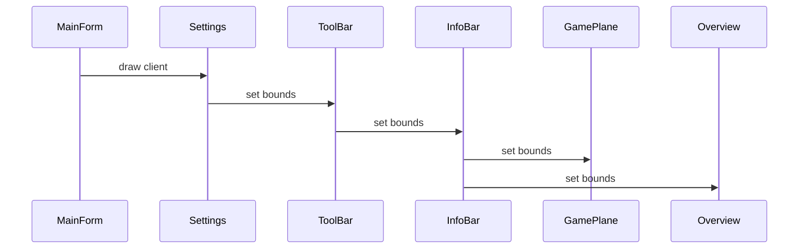
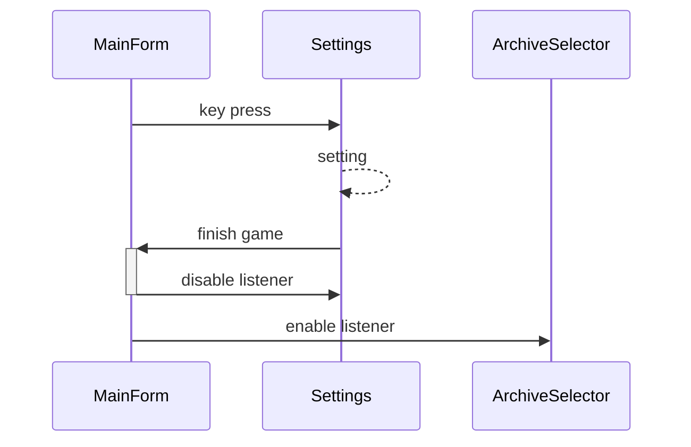
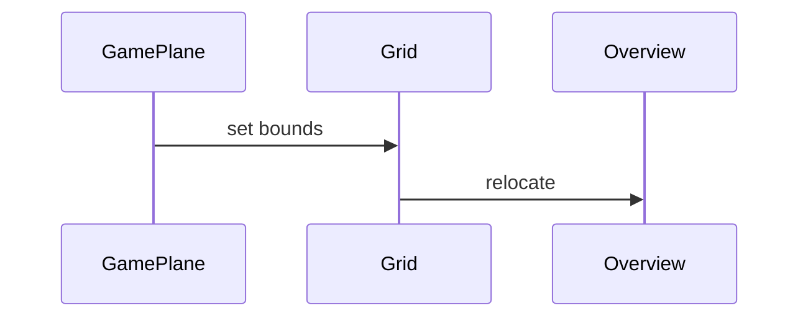
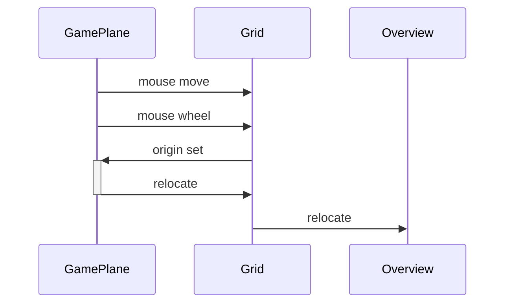
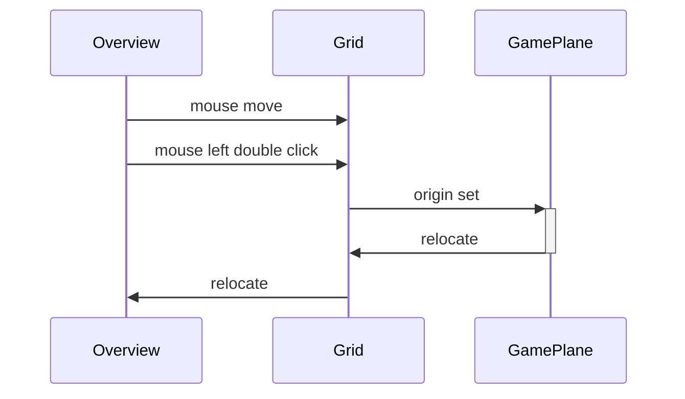

## select archive

```mermaid
sequenceDiagram
    ArchiveSelector->>+MainForm: archive select
    MainForm->>-ArchiveSelector: disable listener
    MainForm->>Settings: enable listener
```

## draw client => play game

```mermaid
sequenceDiagram
    MainForm->>Settings: draw client
    Settings->>ToolBar: set bounds
    ToolBar->>InfoBar: set bounds
    InfoBar->>GamePlane: set bounds
    InfoBar->>Overview: set bounds
```

## finish play game

```mermaid
sequenceDiagram
    MainForm->>Settings: key press
    Settings-->>Settings: setting
    Settings->>+MainForm: finish game
    MainForm->>-Settings: disable listener
    MainForm->>ArchiveSelector: enable listener
```

## draw grid

```mermaid
sequenceDiagram
    GamePlane->>Grid: set bounds
    Grid->>Overview: relocate
```

## move grid => game plane

```mermaid
sequenceDiagram
    GamePlane->>Grid: mouse move
    GamePlane->>Grid: mouse wheel
    Grid->>+GamePlane: origin set
    GamePlane->>-Grid: relocate
    Grid->>Overview: relocate
```

## move grid => over view

```mermaid
sequenceDiagram
    Overview->>Grid: mouse move
    Overview->>Grid: mouse left double click
    Grid->>+GamePlane: origin set
    GamePlane->>-Grid: relocate
    Grid->>Overview: relocate
```